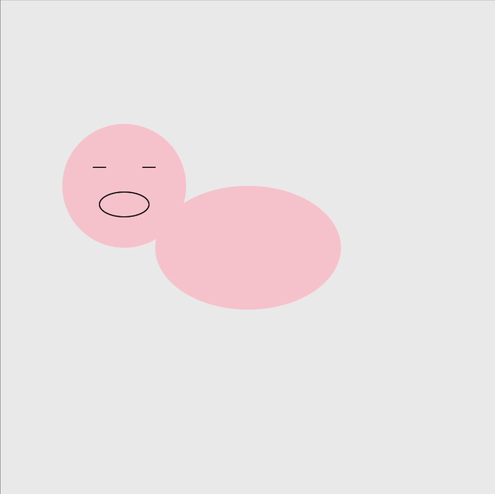
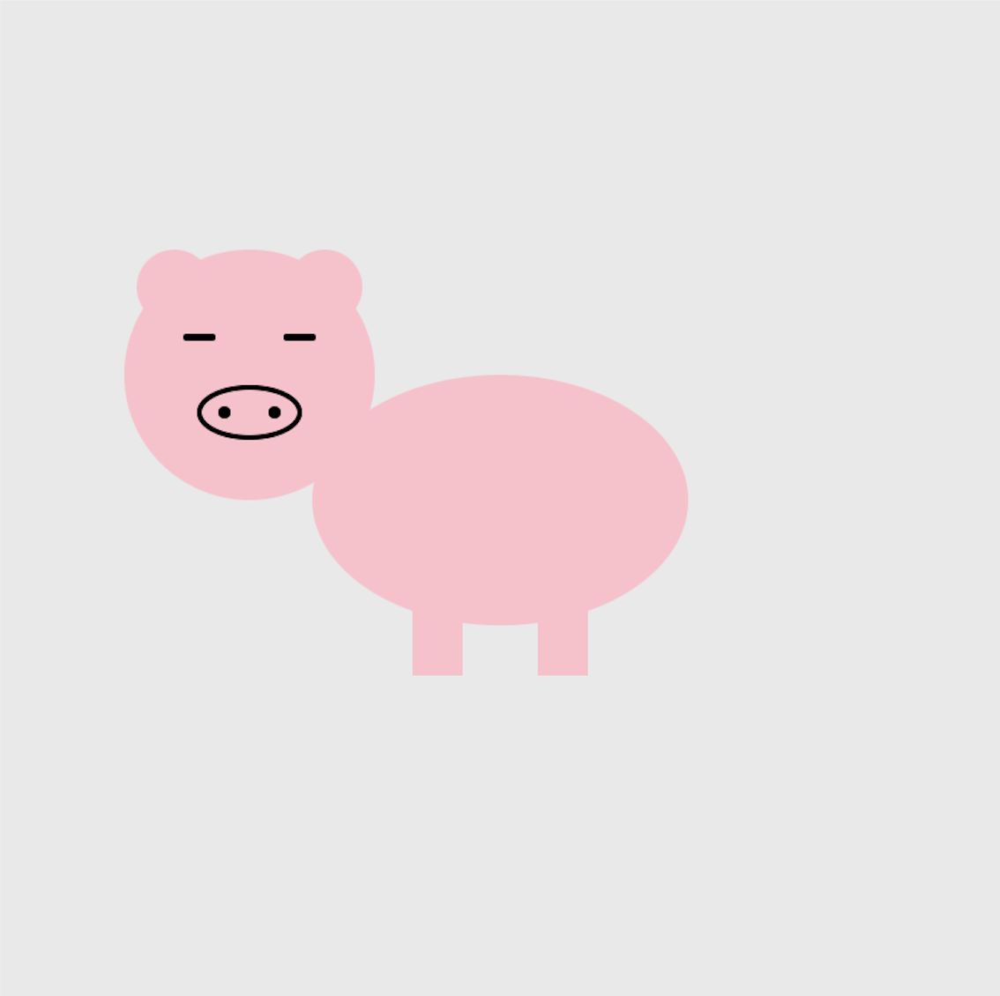
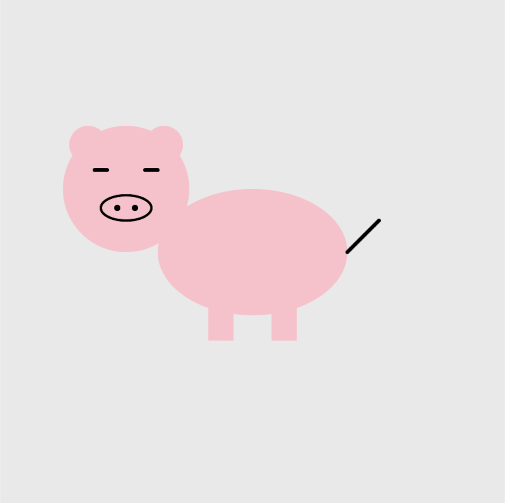
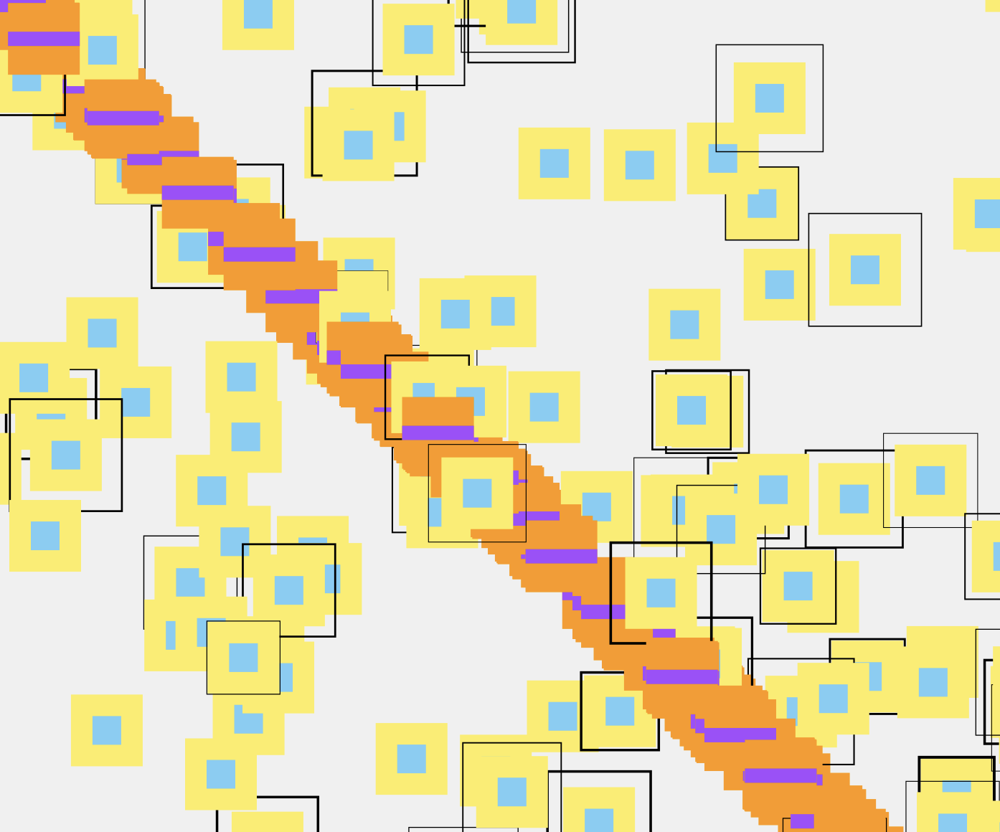
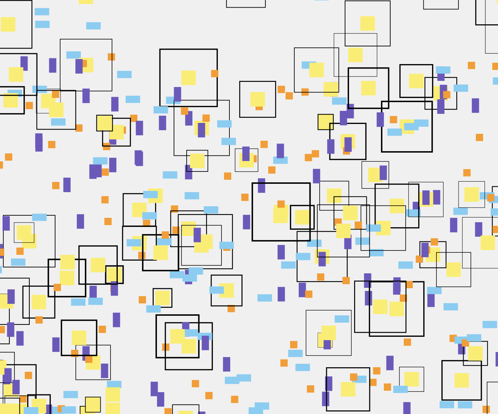
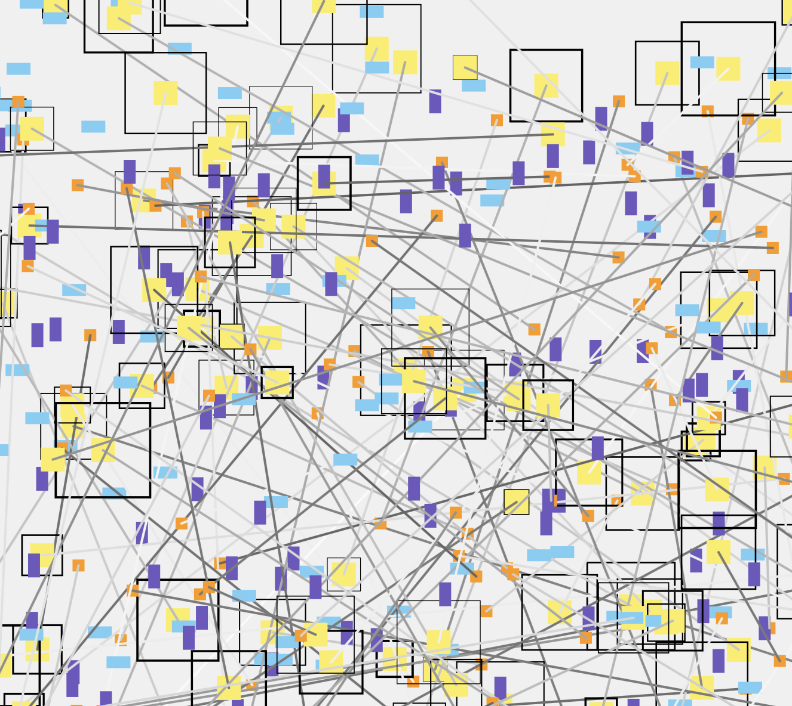

## Activity 1a

### Concept
- Function setup & funtion draw 
- Drawing lines & shapes 
    - ex: rect(), ellipse()
- Fill color
    - ex: fill(), stroke()

### Screenshots
Progress of Drawing a Pig:

## Activity 1b

### Concept
- set variables beforehand
- random()

### Screenshots

### Videos
[video 1](<https://drive.google.com/file/d/1D0qv0Cf5aX_jVjFdfzRtTgCaaULO49mo/view?usp=drive_link>)

[video 2](<https://drive.google.com/file/d/1GJu4JYlUMCENr2JZD0CLUv3B2uYFLMRo/view?usp=drive_link>)

[final version](<https://drive.google.com/file/d/1gkwuA0O22Cah-to6tb7m6e1-ezheiUhc/view?usp=drive_link>)