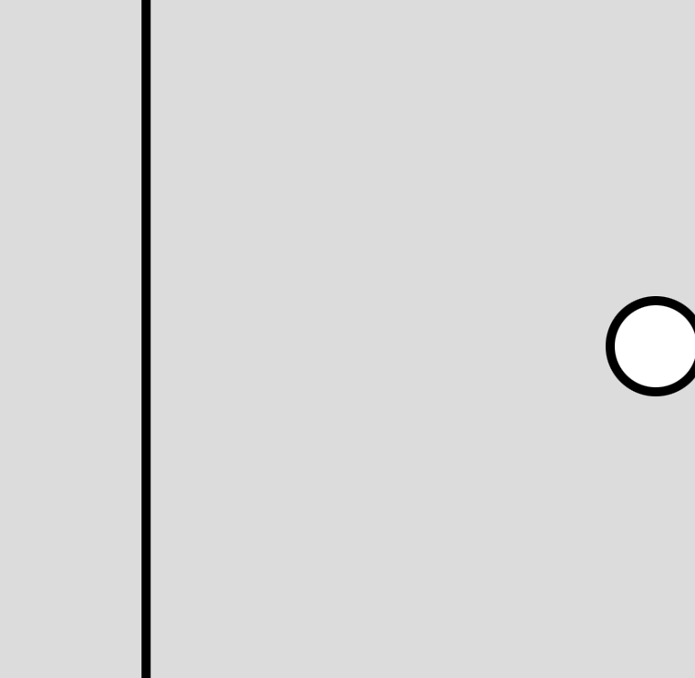
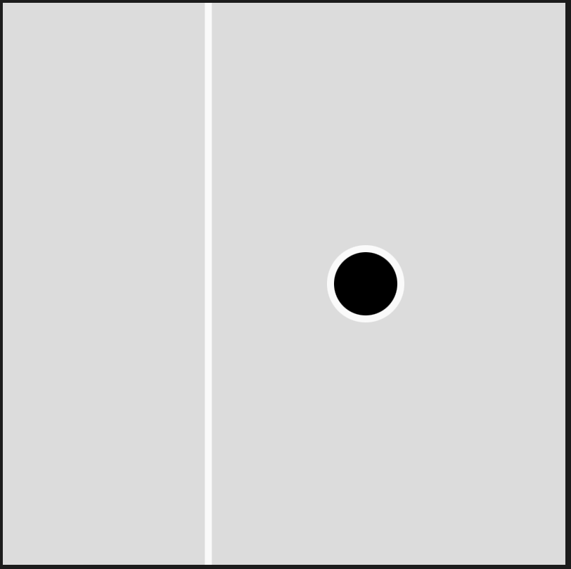
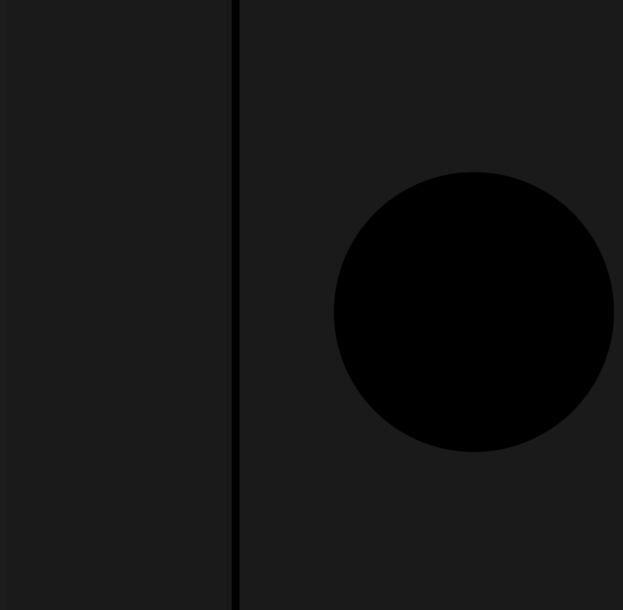
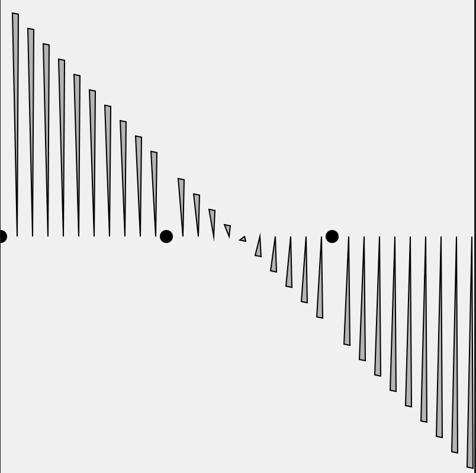
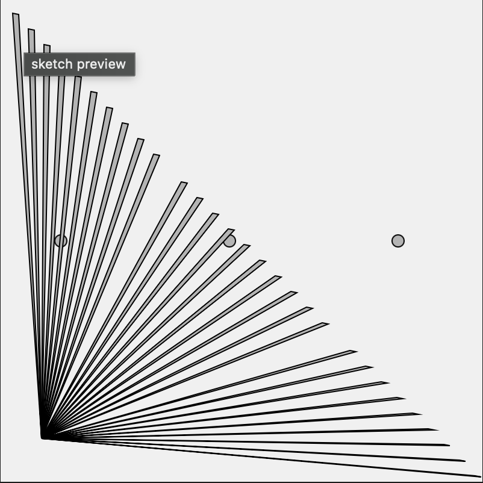
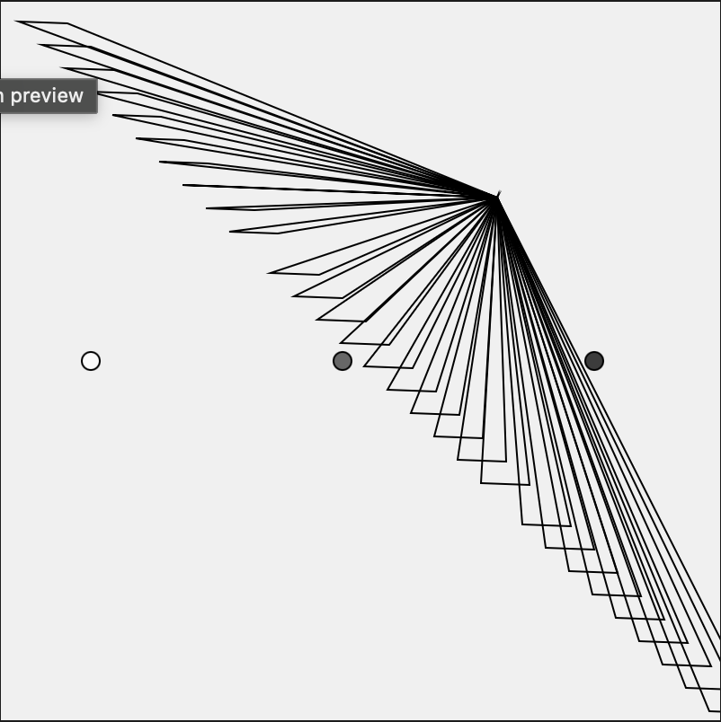

## Activity 2a

### Concepts
- Make object move
- Interactive elements:
    - if statements
    - press mouse 
    - press key
    - swtich ()

### Elements I Added 
- move mouse to change color of the lines
- press mouse to change ball color and increase its size
- press keys 1, 2, 3 to change backgound color to red, green, blue, respectively; press other key to change random gray scale backgroud color

### Screenshots

### Video
[final output](https://drive.google.com/file/d/1lfbX_xaXYaoi11p0yeSnuxKilU5Ofh7o/view?usp=drive_link)

## Activity 2b

### Concepts
- use loop to draw repeated shapes 

### Screenshots

### Videos
[video 1](<https://drive.google.com/file/d/1LCGiw_IE0kCr03XCw0JCDpwC6IjxSrF9/view?usp=drive_link>)

[final version](<https://drive.google.com/file/d/1jNful5J5Ggmuy4b3bBvA9nLEiKdSUb_l/view?usp=drive_link>)