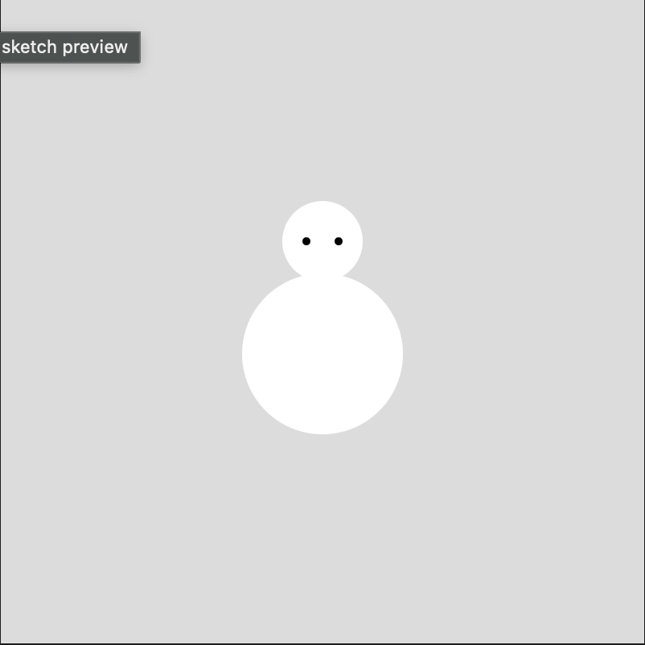
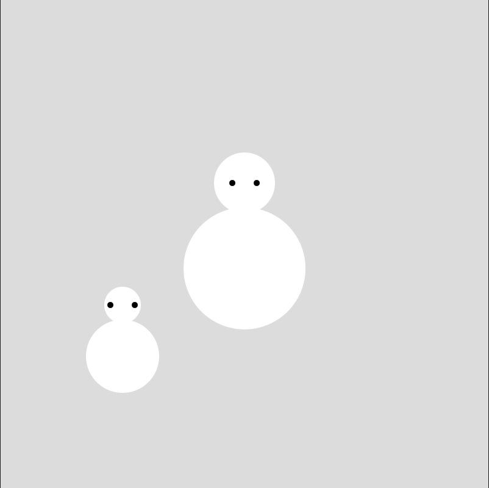
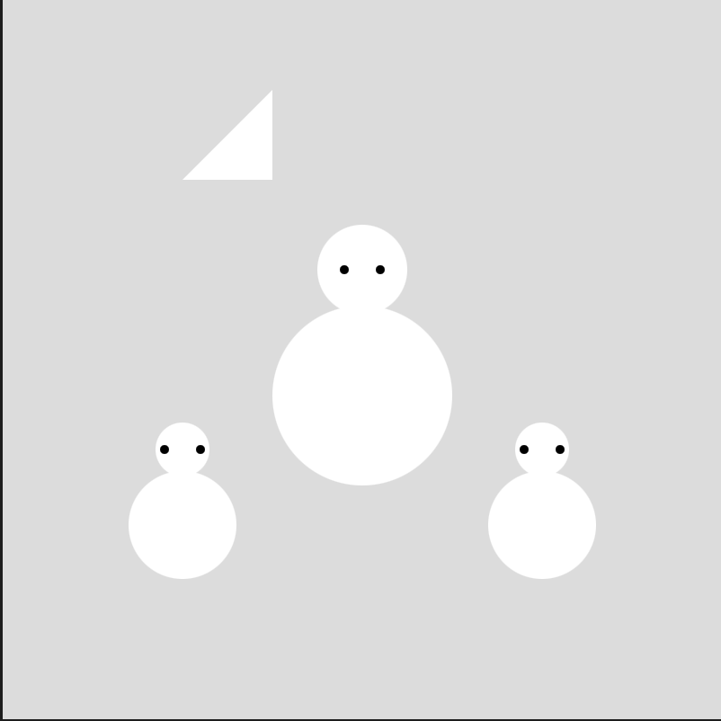
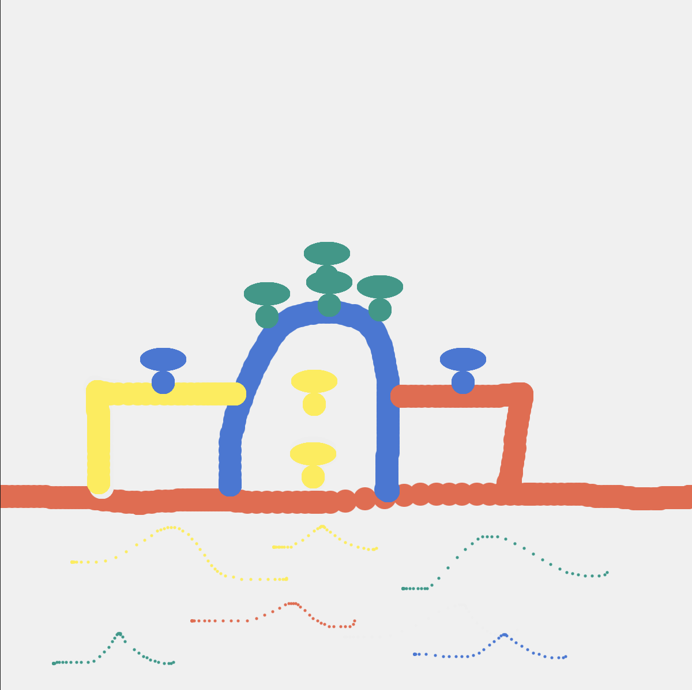
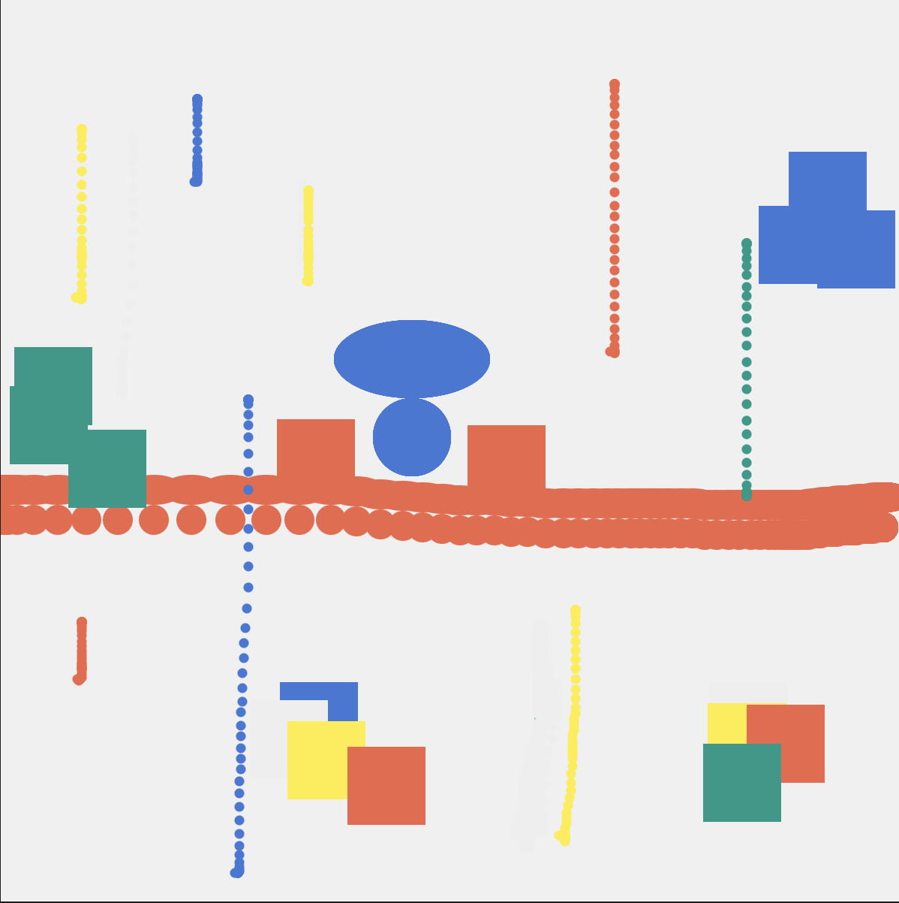

## Activity 3a

### Concept
- color palette
- push and splice index

### Interactive Elements 
- press mouse to increase circle size
- press p to push new color into the palette
- press s to splice color from the palette
- press other keys to change the circle color according to the palette

### Video
[final output](<https://drive.google.com/file/d/1OaY7jdolFt0sg4QZptDu2yRWDsfekYLc/view?usp=drive_link>)

## Activity 3b

### Concept
- using arrays
- creating a function using array to form more complicated repeated shapes/patterns 

### Screenshots

## Activity 3c

### Added Elements
- rock brush
- line brush

### Screenshots

### Video
[line brush](<https://drive.google.com/file/d/1qi-AZggX-HNZcl4uPRR7Vq-BcJgOO_LI/view?usp=drive_link>)