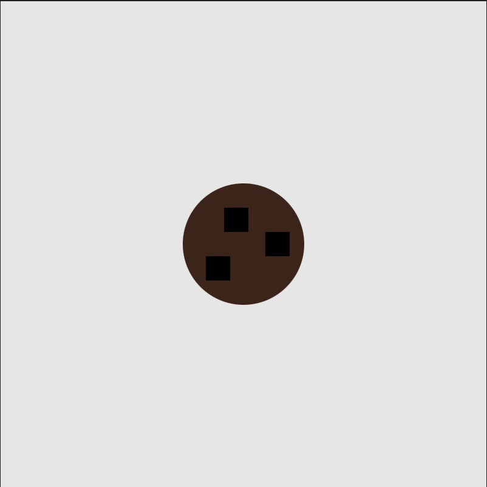
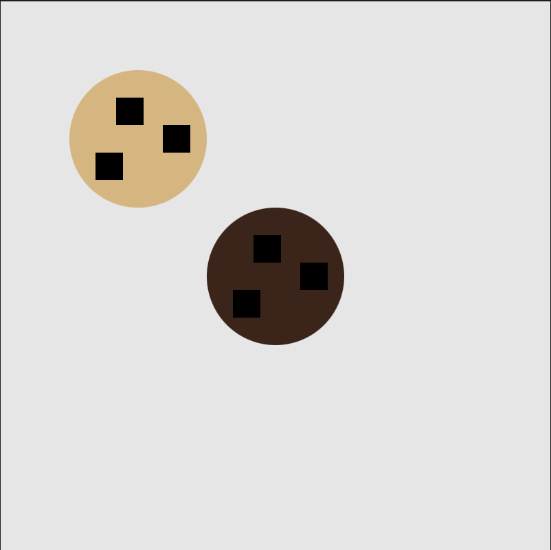
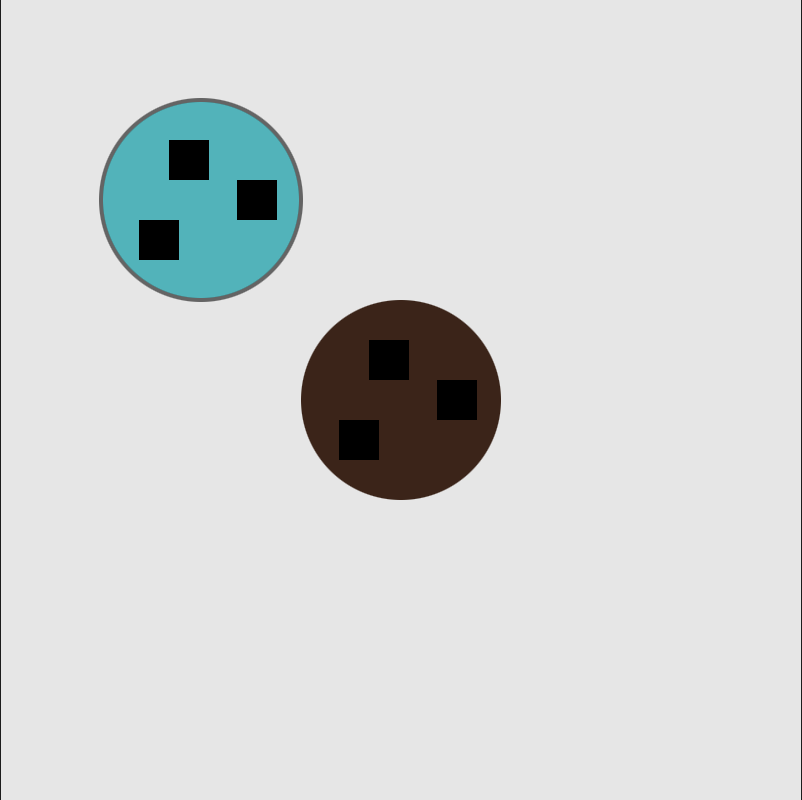
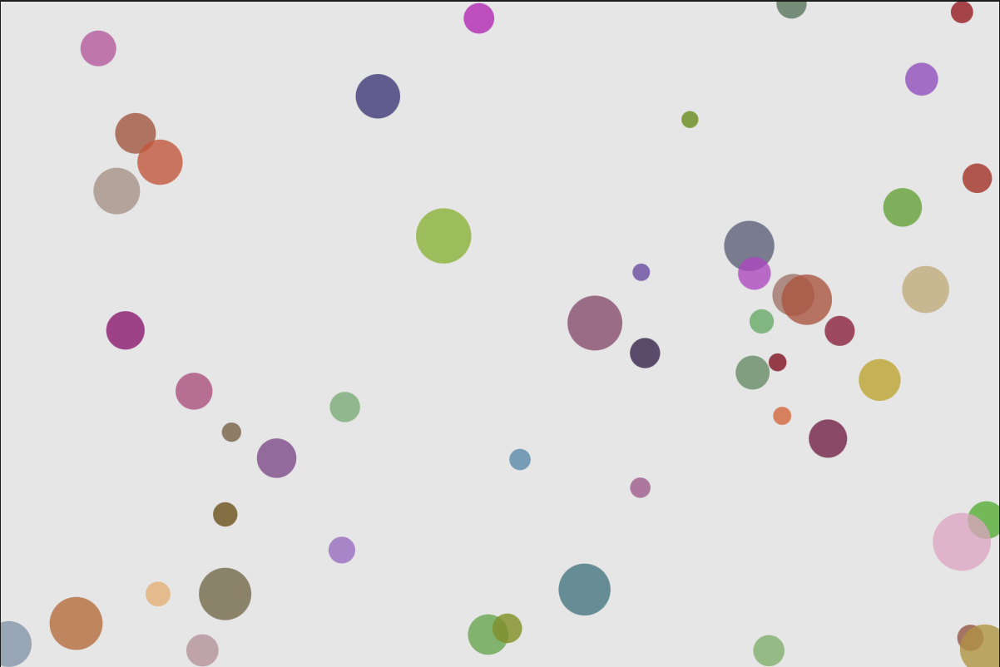
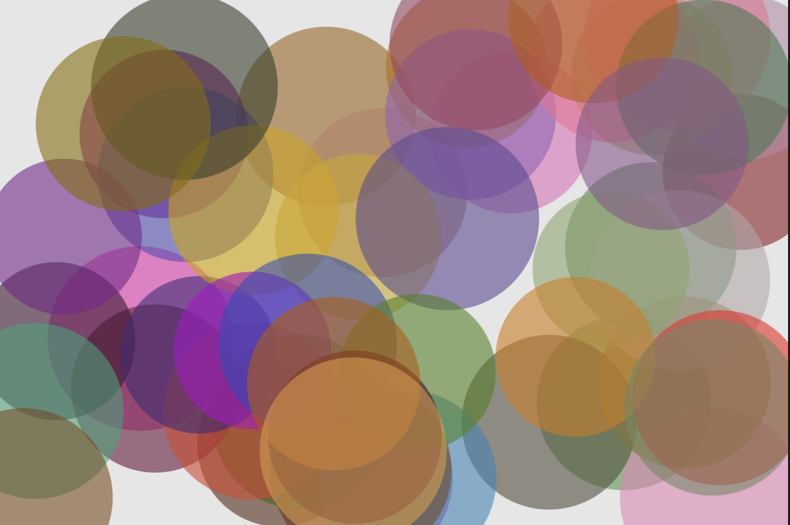

## Activity 4a

### Concepts
- class
- elemts under class such as show, update, move, and more.

### Interactive Elements 
- press mouse to change cookie flavors
- use arrow keys to move the cookies

### Screenshots

### Videos
[video 1](<https://drive.google.com/file/d/1HxDbgvckbo1f4rTlDXleR4OJkE4ey9ek/view?usp=drive_link>)

[final output](<https://drive.google.com/file/d/1HokSDeoo0zRNSIjp4rT3GJ2IQnMRwCYg/view?usp=drive_link>)

## Activity 4b

### Concepts
- using arrays, loops, and class together

### Interactive Elements 
- click mouse to add a circle at the same location
- press key to let circles shine random gray scale colors
- circles move around and gradually shrink 

### Screenshots

### Video
[final output](<https://drive.google.com/file/d/1BEJ5p4Qu3n4qSZerQLVw6pRR7PNuP-Ll/view?usp=drive_link>)

