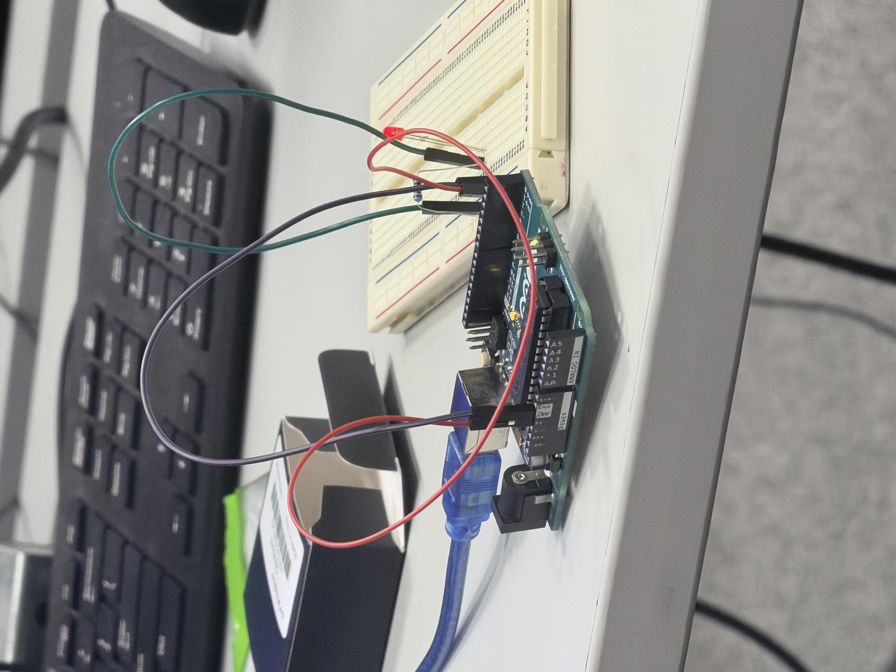
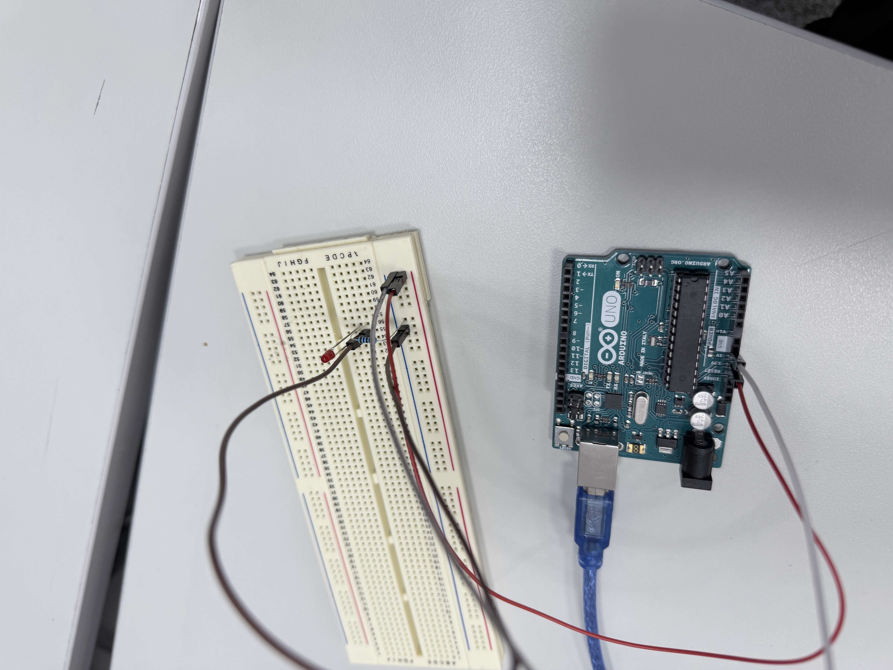
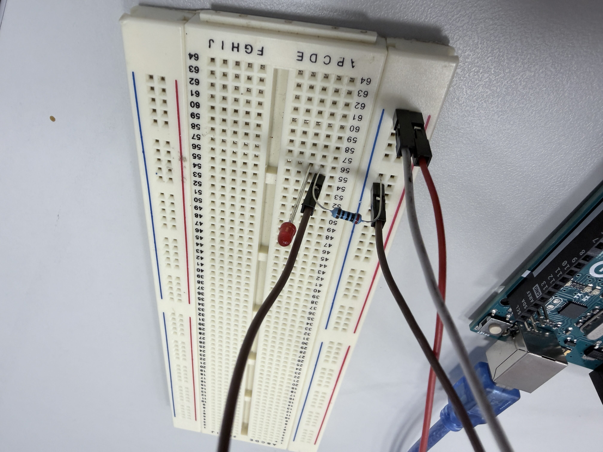
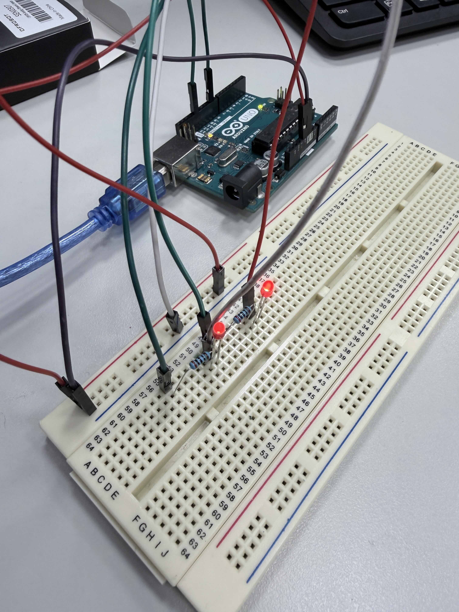
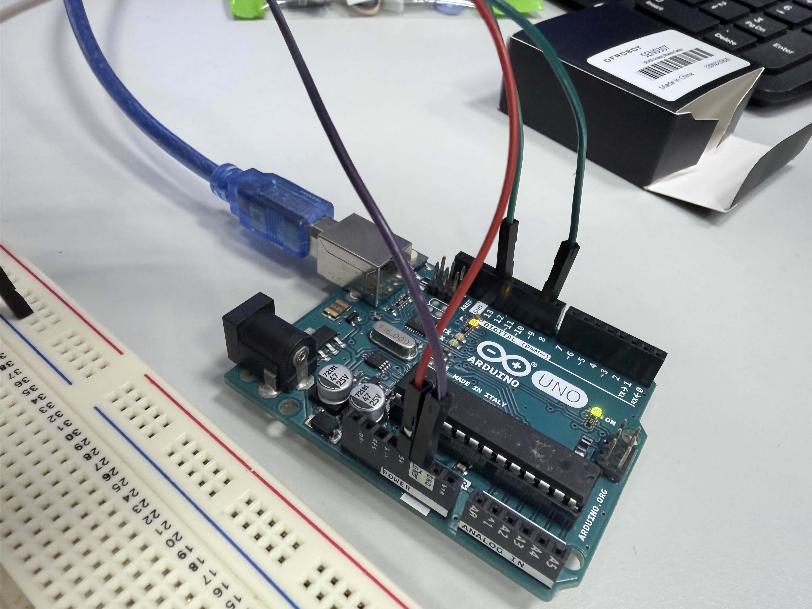
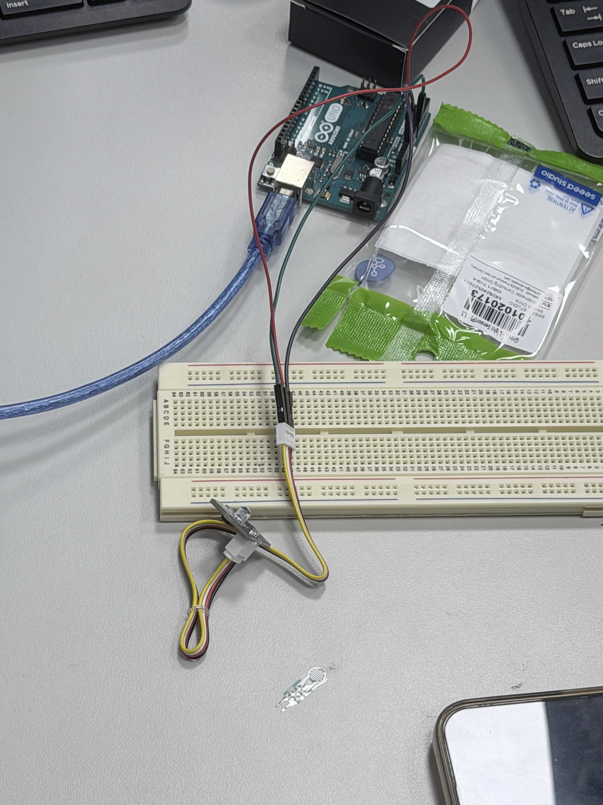
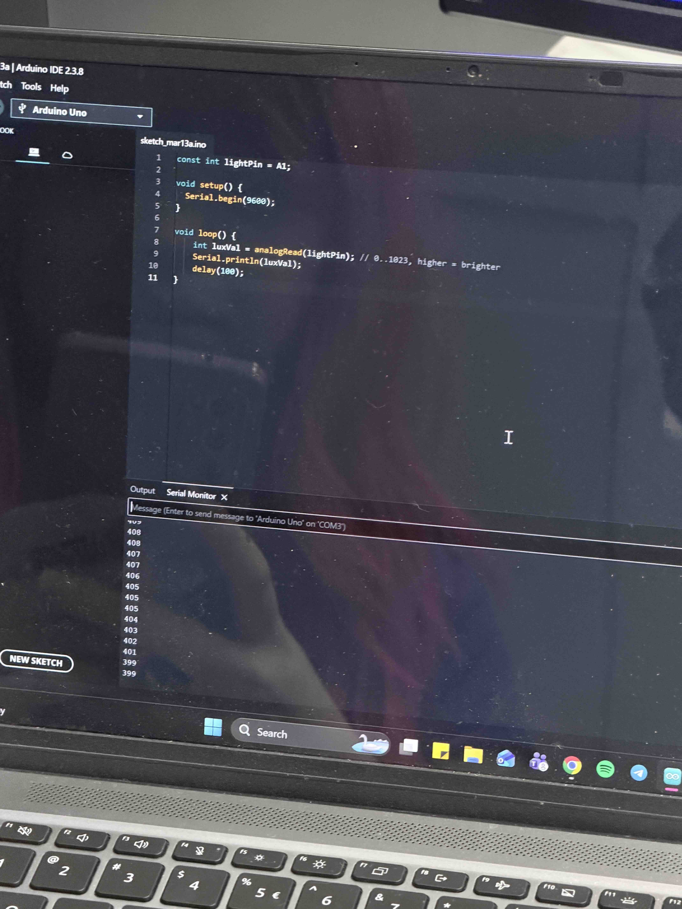
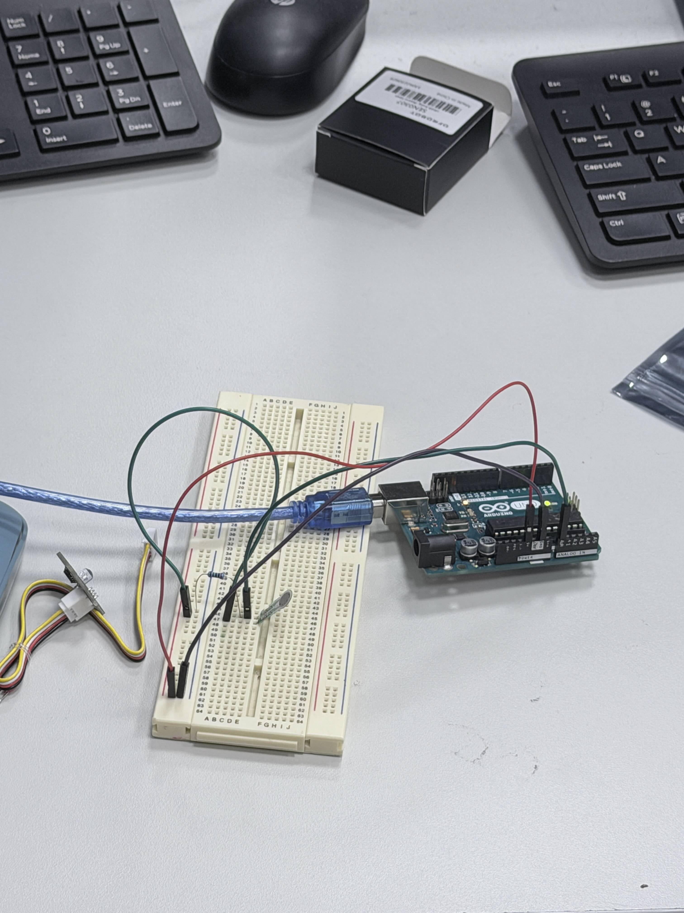
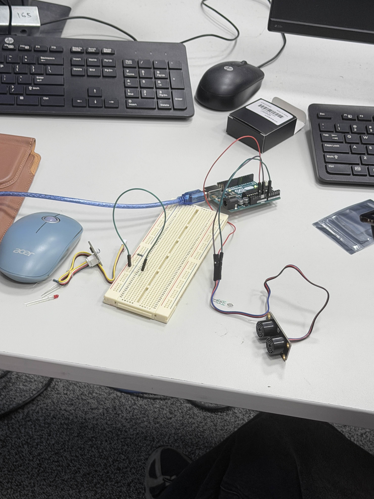
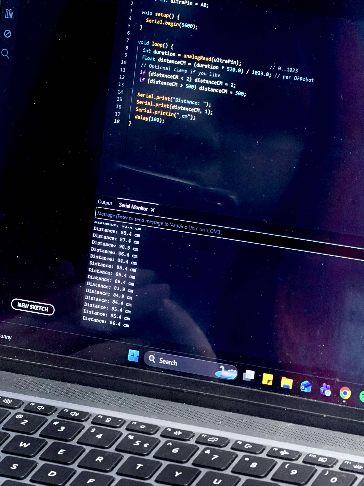

## Activity 8a

### Concept
- using code to control the Arduino
- connecting wires and LED lightbulb 
- always on; on/off control; fading 

### lightitup01

### lightitup02

[video01](<https://drive.google.com/file/d/1iANTAJNcLSQ5qLiMBqEI69Cm8FLcyP-Z/view?usp=drive_link>)

### lightitup03
[video02](<https://drive.google.com/file/d/14nutJh7vbQAAnl2rsgRUdeOBM2-C1-Yu/view?usp=drive_link>)

### Other Images

### Other Videos
[video03](<https://drive.google.com/file/d/1Pwzbdns4h3At4f0ayN0EGqaIRw3lMaa5/view?usp=drive_link>)

## Activity 8b

### Concept
- connecting sensors to the Arduino
    - Phototransistor sensor
    - Force sensor
    - Ultrasonic sensor

### Images

### Video
