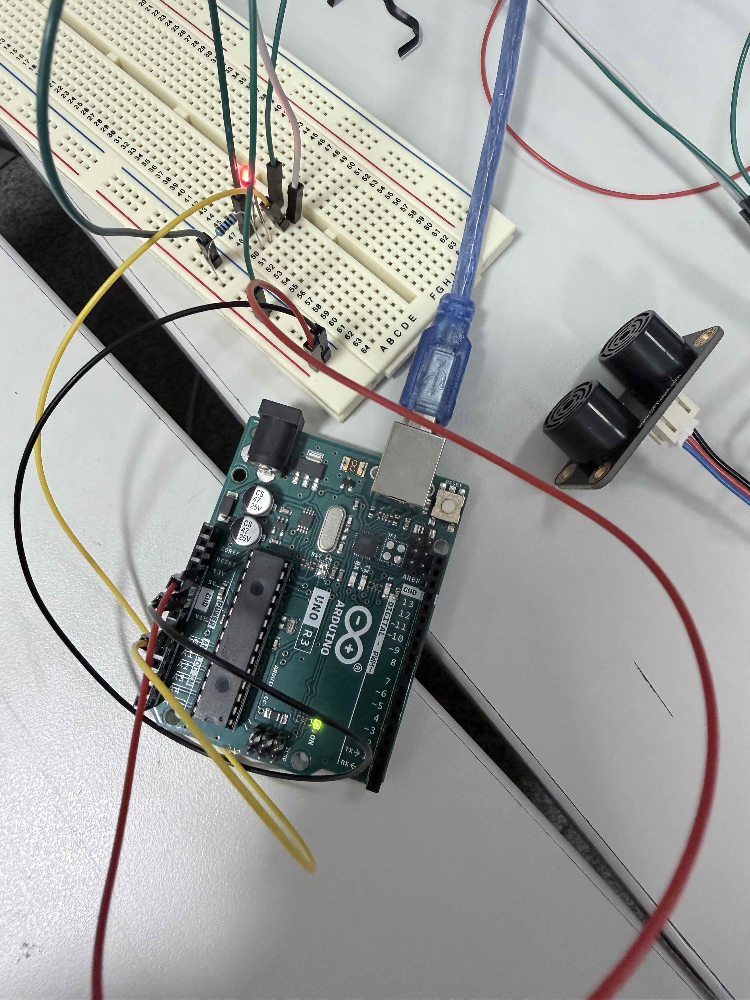
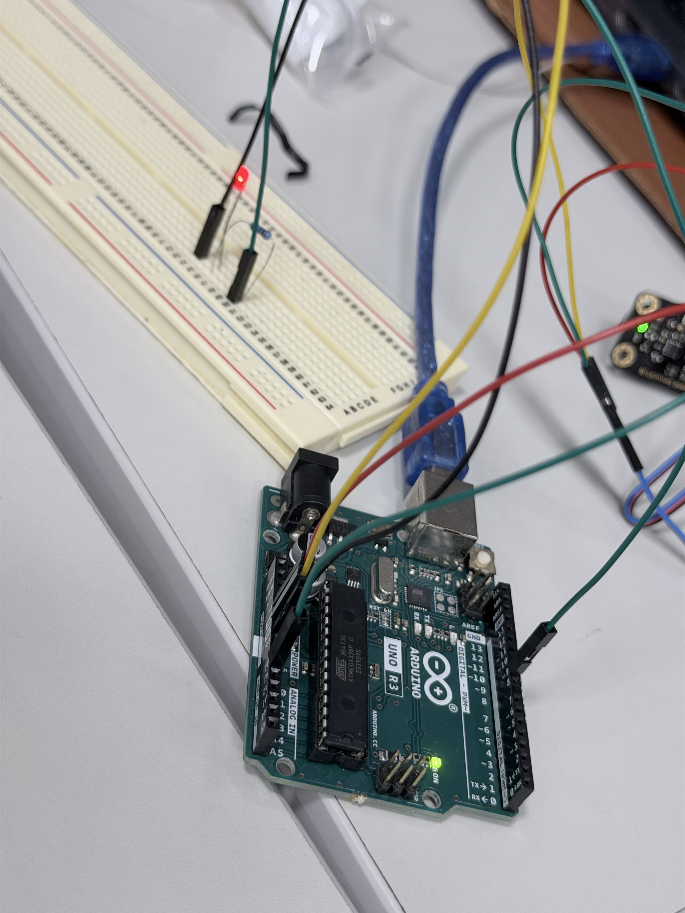
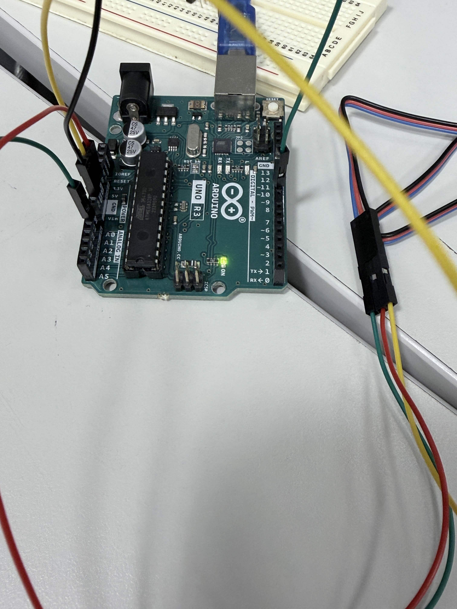

## Activity 9a

### Concept
- using the map() function to turn readings from the Ultrasonic Sensor into LED behavior
- distance influence brightness of lightbulb

### Images

### Videos
[video01](<https://drive.google.com/file/d/1wWIanZwAE8ATGMo3zM0hALBcx5IqJevJ/view?usp=drive_link>)