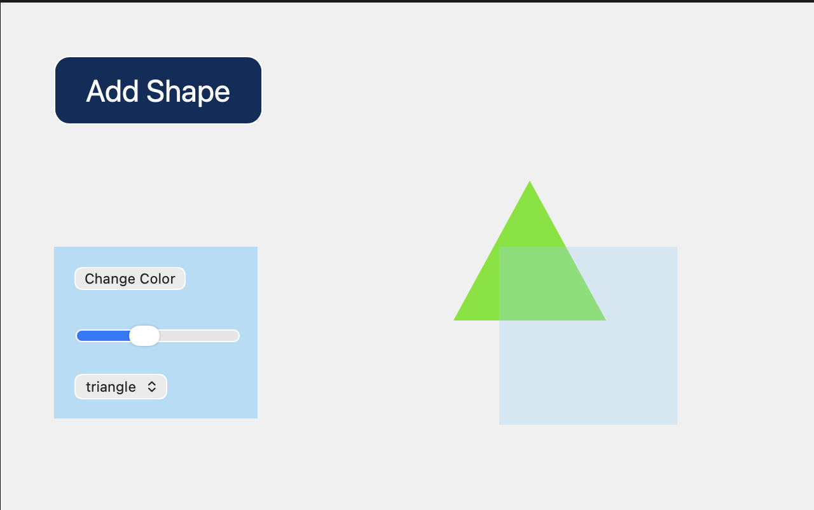
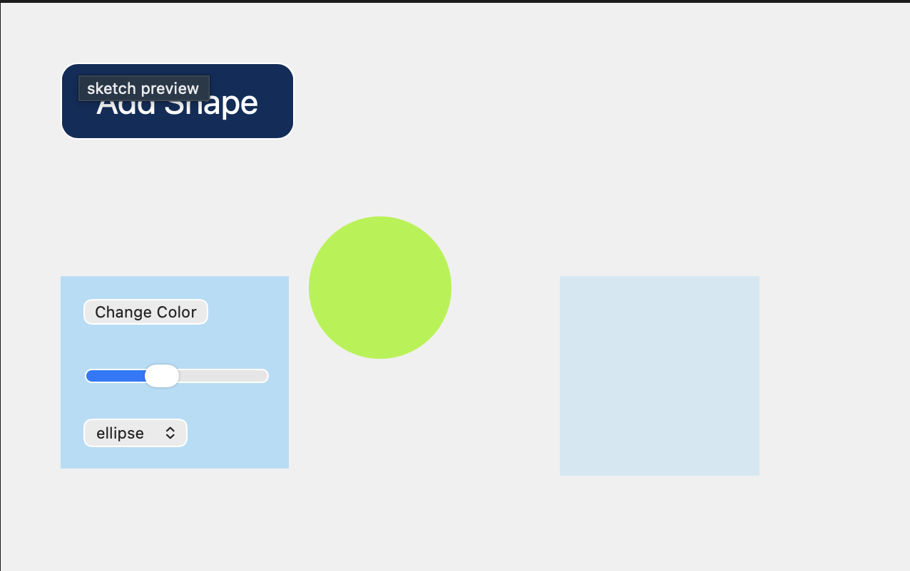
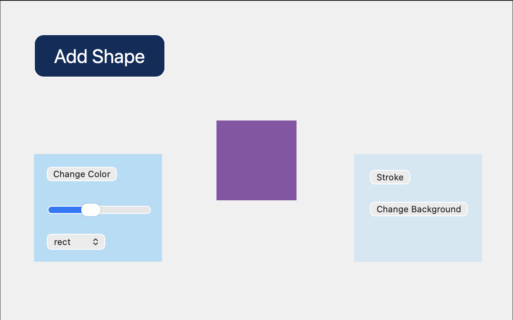

## Activity 10

### Concept
- add UI features such as buttons for interactions

### Interactive elements
- click on the buttons to change the shape, color, stroke, and background color
- use the slider to change the size of the shape
- "Add Shape" button as a prank button that clears the page

### Images

### Video
[final output](<https://drive.google.com/file/d/14kcgfZa_EZD_u_OOkpxIvaAlG3lgFaYG/view?usp=drive_link>)