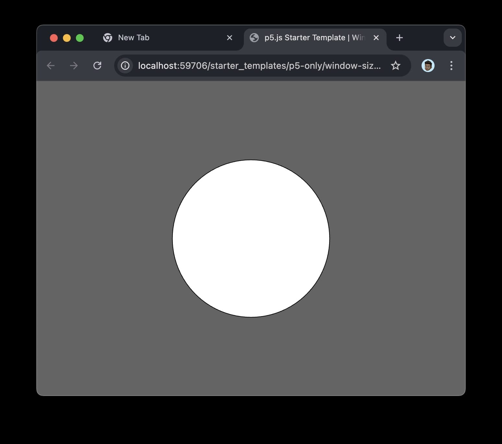
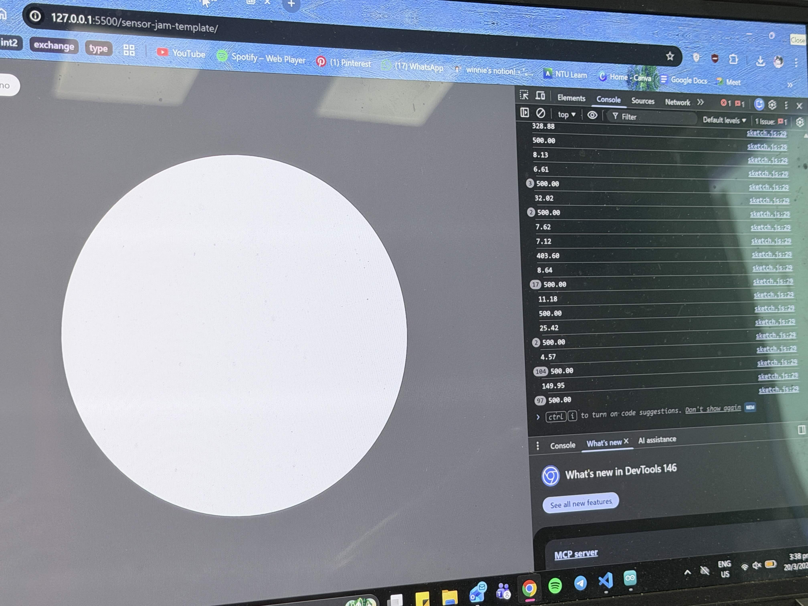

# Activity 9b Sensor Jam

### Concept
- Connecting Arduino with a ultrasonic sensor to a live server
- Adjust the code to change how distance affects the live server page

### Documentation

[The distance changes the size of the circle](<https://drive.google.com/file/d/1iMmSHM_Gk6Gq-qboI4kN78hh2TfDLt8S/view?usp=drive_link>)

[Circle changes to black when shrinking](<https://drive.google.com/file/d/18Hqwu-ucRS1GeKydDkuM7DA8-DM5v9m3/view?usp=drive_link>)

[Circle changes to purple when expanding, blue when shrinking](<https://drive.google.com/file/d/1WwIXNQ6EqhnHEB8eOJL9v9Q7GmDY0flS/view?usp=drive_link>)

[demo video](<https://drive.google.com/file/d/1ImoF4kuBbWCjIFTtGFwP8NZVEoTmAGuC/view?usp=drive_link>)
