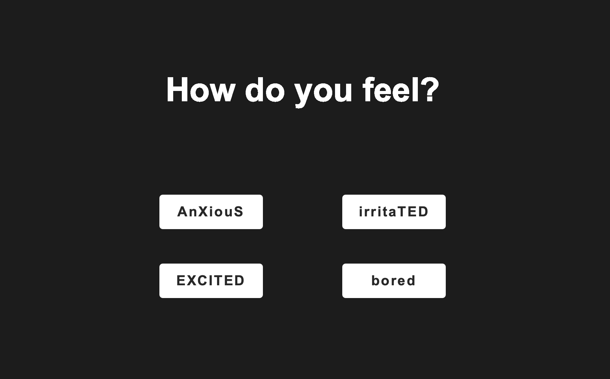
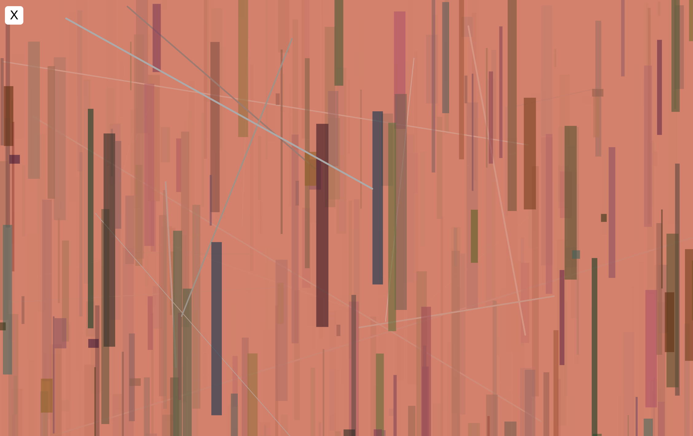
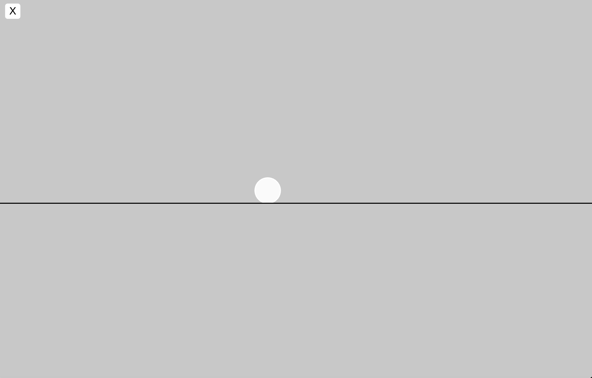
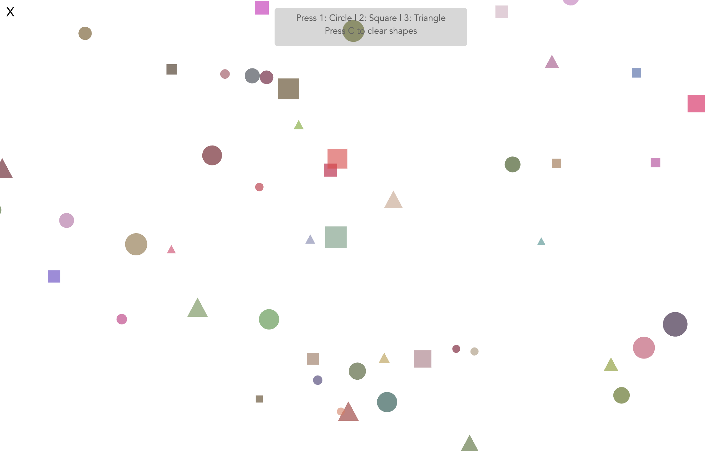
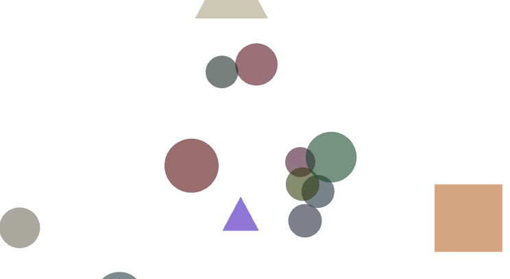

# Final Project

### Concept
The project uses a mix of elements learned in the previous classes such as buttons, class, mouse, keys, etc. 
The idea of this project is to emphasize on the emotion that the user chooses through interactive elements. For example, the original button in in the irritated emotion does not allow the user to go back to the home page. 
This is intended to be a simple, fun work.

### Instructions 
1. choose a feeling 
2. interact with the page (with or without instructions)
3. choose another feeling or close out

### Documentation

[shape not changing correctly](<https://drive.google.com/file/d/18X-UjaWdhgvrbkMvOMj9OuBs162w_rA0/view?usp=drive_link>)

### Demo Video
[Demo](<https://drive.google.com/file/d/1tFp7wYwvwcU2GJW9xWF9DtAWRx7HUBXx/view?usp=drive_link>)

## Reflection
# 
When generating ideas for this project, I immediately thought about using buttons and emotions as the baseline. After learning how make the home page disappear after clicking a button, the outline of the project became clearer. 

Most pages behind each emotion were inspired by the activities done in the previous classes. I made adjustments and combined additional features to make the pages more interactive and to let the entire atmosphere better align with the specific emotional state. 

When combining all the knowledge from the previous classes, it was difficult to recall all the codes, even the logic sometimes. This made me realize the importance and usefulness of having a 'code book' of everything that you have written before. My documentations from the previous classes made the entire process much more efficient. 

While coding, there was a moment where I made everything seem more complicated. It was only after I looked back at the earlier activities that made me realize, or remeber, how some code and their logic were simple. 

The most challenging part of this project was to organize the code and keep track of everything. Although from the broader view, the general logic is not complex, the fact with four different pages tend to make the code messier. Nevertheless, this did help me to gain experience in writting longer codes, which I find helpful to use sections to keep different features separate. 
